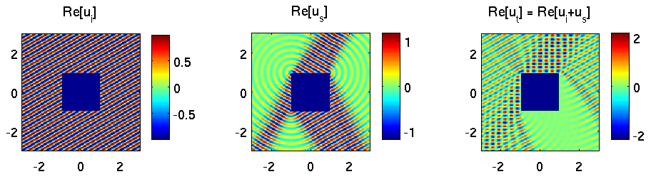
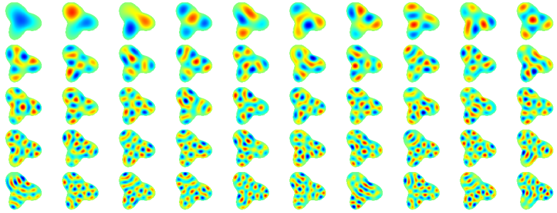

# MPSpack : 2D Helmholtz scattering and eigenvalue problems via particular solutions and integral equations

### Alex Barnett 4/12/16.  Version 1.4

MPSpack is a user-friendly and fully object-oriented MATLAB toolbox
that implements the method of particular solutions (aka Trefftz or
nonpolynomial FEM, including the method of fundamental solutions,
Fourier-Bessel local expansions, singular corner expansions), and
integral equation methods (including some basic corner handling), for
the efficient and often spectrally-accurate solution of Laplace
eigenvalue problems, interior/exterior Helmholtz boundary-value
problems (e.g. wave scattering), periodic diffraction problems, and
related PDE problems, on piecewise-homogeneous 2D domains.

Version 1.0 was released in 2009, and co-authored with Timo
Betcke. Since then I have been the main developer; it has settled
into a repository for a variety of new numerical methods developed for
corner domains, layer potentials, periodic problems, and high-frequency Dirichlet and
Neumann eigenvalue problems, enabling this research to be *reproducible*.
It is stable and will not have much
future development. Instead I and colleagues expect to release a
replacement package for integral equations which will include
close-evaluation quadratures (Helsing, QBX, etc).

*I am grateful for the support of the National Science Foundation
under grants DMS-0811005 and DMS-1216656; and Betcke for support of
the Engineering and Physical Sciences Research Council Grant
EP/H00409/1. We also are thankful for the inclusion of codes by
V. Rokhlin, L. N. Trefethen, A. Pataki, Z. Gimbutas, D. M. Schwarz, S. Hawkins, B. Gustavsson, and several others.*

## Requirements

1. MATLAB 2008a or newer (in particular, no toolboxes needed)

2. Optional requirements for tweaks and fast algorithms (see [manual](doc/manual.pdf)):
  * C and Fortran compilers such as gcc and gfortran.

  * GNU Scientific Library [GSL](http://www.gnu.org/software/gsl)

  * [FMMLIB2D](http://www.cims.nyu.edu/cmcl/fmm2dlib/fmm2dlib.html) for Helmholtz fast multipole method

  * [LP2D](https://math.dartmouth.edu/~ahb/software/lp2d.tgz) for Alpert quadrature correction to FMM on smooth curves

MPSpack is released under GPL v.3; please contact me for other license
options.

## Installation

Install `git` (eg on an ubuntu/debian
linux system use `sudo apt-get install git`). Then as usual do
```git clone https://github.com/ahbarnett/mpspack```
to download and create the directory `mpspack` containing the package.

In MATLAB, type `addpath /path/to/mpspack`. See Usage below to test your
installation.

Add the above `addpath` command to your MATLAB `startup.m` file if you
want the MPSpack toolbox available by default.

To install tweaks (MEX interfaces to Bessel/Hankel/inpoly), which are
tested only in a linux environment, from a shell in the directory
`mpspack` type `make`. If you have trouble, edit the library locations
in `make.inc`.

See the [manual](doc/manual.pdf) for linking to fast algorithms (FMM).

*Note an obsolete [snapshot](https://code.google.com/archive/p/mpspack/)
of version 1.33 from 2014 sits on the sadly-defunct `googlecode`. Please use the github version.*

## Usage

To test your basic installation:
in MATLAB make sure you're in the `mpspack` top directory and type
`run test/testdielscatrokh` which should take about 1 second to run
and produce a wave scattering figure from a smooth dielectric domain,
along with a pointwise error, which should be small (ie around 1e-14).

To test whether your tweaks installation worked:

* `run test/testbasis` which should give around 0.2 us per eval for MFS,
SLP, and DLP bases. Older versions of MATLAB will give only 2 us per eval.

* `run test/testinpolywrapper` which should compare the slow MATLAB
against the fast Luong code.

See [tutorial](doc/tutorial.pdf) and [manual](doc/manual.pdf) for detailed examples and usage.

## Examples

1. Frequency-domain scattering from a square, accurate to 10 digits, computed in a few seconds on a laptop. Spectral convergence is achieved using the following ingredients: decomposition into subdomains (nonpolynomial FEM), fractional-order Fourier-Bessel expansions around corners, and an exterior fundamental solutions representation. In MPSpack this only 20 lines of code for Dirichlet or Neumann cases (see `examples/tut_square.m`):

  

1. The first 45 Dirichlet eigenmodes of a smooth planar domain, computed to 12 digit accuracy and evaluated on a grid of 3600 points, in around 1 second per mode. Convergence is again spectral, using a layer potential, Kress quadratures, and analytic root-finding on a Fredholm determinant. 9 lines of  MPSpack code (see `examples/tut_evp.m`):

  

1. Finally, an entertaining example of acoustic (sound-hard) scattering from some smoothly digitized letter shapes, computed to 10 digit accuracy by Perrin Meyer (contact him for code). The wave is incident from about 4 o'clock:

  

There are other pictures in the [gallery](gallery) and plenty in the [tutorial](doc/tutorial.pdf).

## References

[Comparable upper and lower bounds for boundary values of Neumann eigenfunctions and tight inclusion of eigenvalues](http://arxiv.org/abs/1512.04165), Alex Barnett, Andrew Hassell, and Melissa Tacy, submitted, Duke Math. J (2015).

[An exponentially convergent nonpolynomial finite element method for time-harmonic scattering from polygons](https://math.dartmouth.edu/~ahb/papers/p.pdf), Alex H. Barnett and Timo Betcke, SIAM J. Sci. Comp., 32 (3), 1417-1441 (2010).

[Fast computation of high frequency Dirichlet eigenmodes via the spectral flow of the interior Neumann-to-Dirichlet map](http://arxiv.org/abs/1112.5665), Alex Barnett and Andrew Hassell, Comm. Pure Appl. Math., 67(3) 351-407 (2014).

[Robust and efficient solution of the drum problem via Nyström approximation of the Fredholm determinant](http://arxiv.org/abs/1406.5252), L. Zhao and A. H. Barnett, SIAM J. Numer. Anal., 53 (4) 1984--2007 (2015).

[A new integral representation for quasi-periodic scattering problems in two dimensions](https://math.dartmouth.edu/~ahb/papers/qpsc.pdf), Alex Barnett and Leslie Greengard, BIT Numer. Math. 51, 67-90 (2011)


## To do list

* Extract the best quadrature schemes for a new BIE2D package

* Interpolation to replace Zp, Zpp for convenience but losing digits
